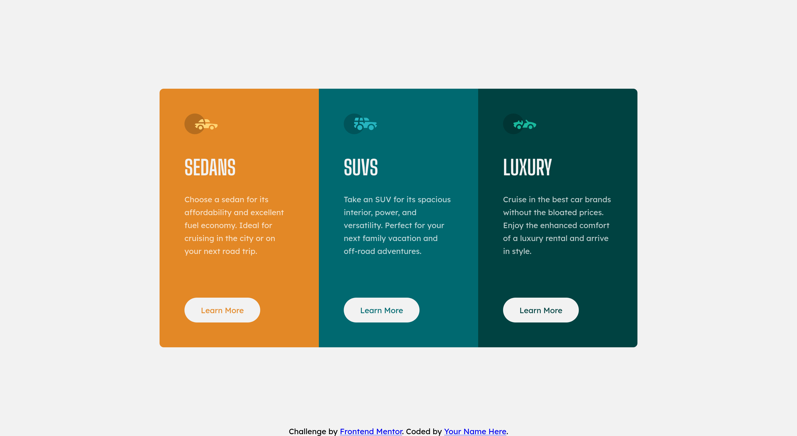

# Frontend Mentor - 3-column preview card component solution

This is a solution to the [3-column preview card component challenge on Frontend Mentor](https://www.frontendmentor.io/challenges/3column-preview-card-component-pH92eAR2-). Frontend Mentor challenges help you improve your coding skills by building realistic projects. 

## Table of contents

- [Overview](#overview)
  - [The challenge](#the-challenge)
  - [Screenshots](#screenshots)
  - [Links](#links)
- [My process](#my-process)
  - [Built with](#built-with)
  - [What I learned](#what-i-learned)
  - [Continued development](#continued-development)
  - [Useful resources](#useful-resources)
- [Author](#author)

## Overview

### The challenge

Users should be able to:

- View the optimal layout depending on their device's screen size
- See hover states for interactive elements

### Screenshots




### Links

- Solution URL: [https://www.frontendmentor.io/solutions/3column-card-component-built-using-flexbox-BObHeHMV5g](https://www.frontendmentor.io/solutions/3column-card-component-built-using-flexbox-BObHeHMV5g)
- Live Site URL: [https://s067130h.github.io/3-column-preview-card-component-main/](https://s067130h.github.io/3-column-preview-card-component-main/)

## My process

### Built with

- Semantic HTML5 markup
- CSS custom properties
- Flexbox
- CSS media queries

### What I learned

I feel like I learned a lot this section and have a lot of things to reflect on. One thing I learned was how to pair relative and absolute positioning together. I have never particularly used absolute positioning for many things, so when it came to aligning the button with the bottom of the card, I learned the card had to be relatively positioned and the button inside it having an absolute position with a bottom property of 0.

```css
.card {
  height: 500px;
  padding: 48px;
  position: relative;
  width: 307px;
}

button {
  background-color: hsl(0, 0%, 95%);
  border: none;
  border-radius: 25px;
  bottom: 48px;
  font: 400 15px "Lexend Deca";
  height: 48px;
  position: absolute;
  transition: all 1s;
  width: 146px;
}
```
Another thing I learned was how to get the border radius of the container to function. At first, the border radius was not applying, but when I looked further, I realized that the border was appearing behind the cards. Thanks to [tole011's comment](https://forum.bricksbuilder.io/t/solved-container-border-radius-not-applied/165), I learned that I needed to hide the overflow of everything inside of the container.

```css
.container {
  border-radius: 8px;
  display: flex;
  flex-wrap: wrap;
  overflow: hidden;
}
```

### Continued development

Something I want to work on more is working with centering content with Flexbox. Despite getting the project to a finished state, I had many issues when trying to have a fully functioning product between mobile and desktop versions. For example, when inspecting in a mobile view, I noticed the container was causing my main tag to stretch beyond the actual content inside. This made positioning a hassle and had to implement media queries to readjust the width of the main section.

I would also like to re-evaluate on how I am using Sass. I have noticed the way I am writing it in an indented fashion has made my CSS file more complicated. for example, instead of:

```css
.card {
  [...]
}
```
I end up with something that looks more like:

```css
body main .container .card {
  [...]
}
```
I'm assuming due to the specificity, it caused me to have a hard time writing my media query because I couldn't simply apply properties to .card, I had to write the whole extended path leading up to it. So I would like to fix this habit and work more towards cleaner code in the future.

Another issue I had was when I used absolute positioning on the attribution section at the bottom of the page, it would appear right in the center and overlap on the mobile view. If anyone has any insight as to why that might be happening, I would really appriciate it!

---

As a side question, since I've been using Sass, my languages on my GitHub repo have only been showing HTML as 100% instead of my compiled CSS file along side it. If you know why that could be, I'd appriciate the info!

### Useful resources

- [SOLVED: Container border-radius not applied](https://forum.bricksbuilder.io/t/solved-container-border-radius-not-applied/165) - This discussion helped me because I was unable to figure out exactly why my border radius was not applying to the container. Thanks tole011!

## Author

- Frontend Mentor - [@S067130H](https://www.frontendmentor.io/profile/S067130H)

